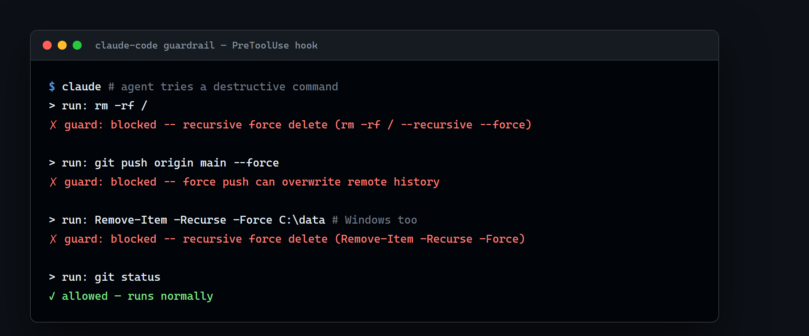

# Claude Code — Safe Automation Starter

A small, production-minded reference showing how to give **Claude Code** real autonomy on a
workflow *without* letting it do something dangerous. It bundles the three pieces clients
actually pay for when they adopt agentic coding:

1. **A guardrail hook** — a `PreToolUse` gate that blocks destructive shell commands before they run.
2. **Scoped permissions** — a `settings.json` that grants the agent exactly what it needs, nothing more.
3. **A reviewer subagent** — a specialized agent that audits a diff before you ship it.
4. **A minimal MCP server** — a self-contained example of exposing your own tools to the agent.

Everything here is generic and safe to run. Clone it, point Claude Code at it, and watch the
guardrail refuse a `rm -rf` while letting normal work through.



---

## Why this exists

Teams don't struggle to make an AI agent *write* code — they struggle to trust it near their
systems. The value is not speed, it's **judgment plus verification**: knowing what to automate
and proving the output is safe. This repo is a compact demonstration of that discipline.

## Layout

```text
.claude/
  settings.json          # scoped permissions + hook registration
  hooks/guard.py         # PreToolUse guardrail (blocks dangerous commands)
  agents/code-reviewer.md# reviewer subagent definition
mcp/
  notes_server.py        # minimal MCP server (stdio), zero external deps beyond `mcp`
  README.md              # how to wire the MCP server into Claude Code
```

## Quick start

```bash
git clone <this-repo>
cd claude-code-safe-automation
claude            # open Claude Code in this directory
```

Then try, inside Claude Code:

- `run: rm -rf /` → **blocked by the guardrail** with an explanation.
- `run: git push --force` → **blocked**.
- `run: ls -la` → allowed.

### The guardrail in isolation

```bash
echo '{"tool_name":"Bash","tool_input":{"command":"rm -rf /"}}' | python .claude/hooks/guard.py
# -> exit 2, prints the reason on stderr (Claude Code treats exit 2 as "deny")
```

## The MCP server

`mcp/notes_server.py` exposes two safe tools (`add_note`, `list_notes`) over stdio. It's a
template: swap the tool bodies for your own domain logic (a ticketing system, an internal API,
a database read) and you have a custom capability the agent can call. See [mcp/README.md](mcp/README.md).

## Extending the guardrail

`guard.py` is a deny-list of patterns. In a real engagement you invert it to an **allow-list**
per project (only these commands, only these paths) and log every decision. The pattern list at
the top of the file is the single place to edit.

---

## Going further

This repo is the minimal, free reference. A more complete **MCP & Guardrails Kit** adds a
fail-closed allow-list mode, an audit log, three MCP server templates (HTTP API + read-only
SQLite included), extra subagents, and a one-command installer — see the link on my profile.

## Author

**Harry Philippe Mbouyap** — Claude Code & AI automation specialist (MCP servers, subagents,
safe-autonomy guardrails). Available for consulting and custom builds.

## License

MIT — see [LICENSE](LICENSE).
